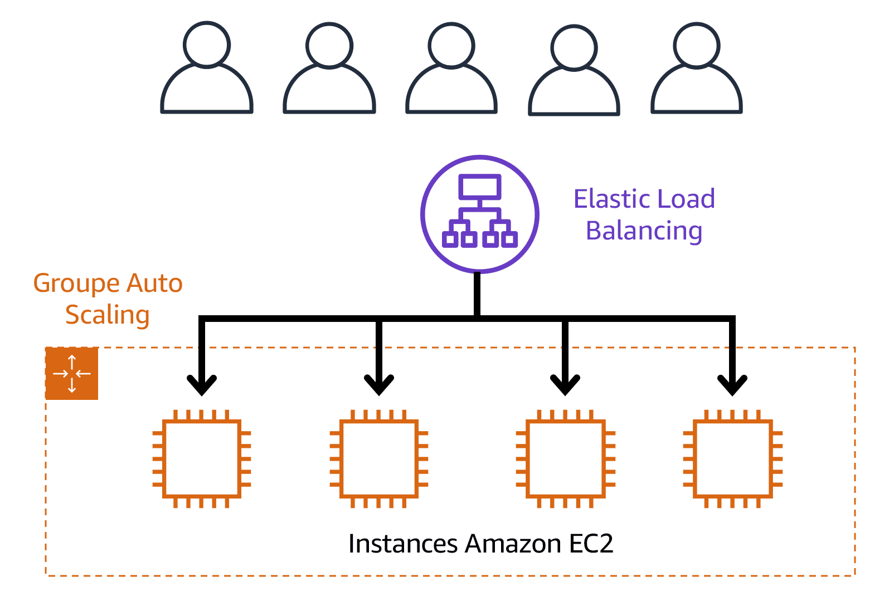
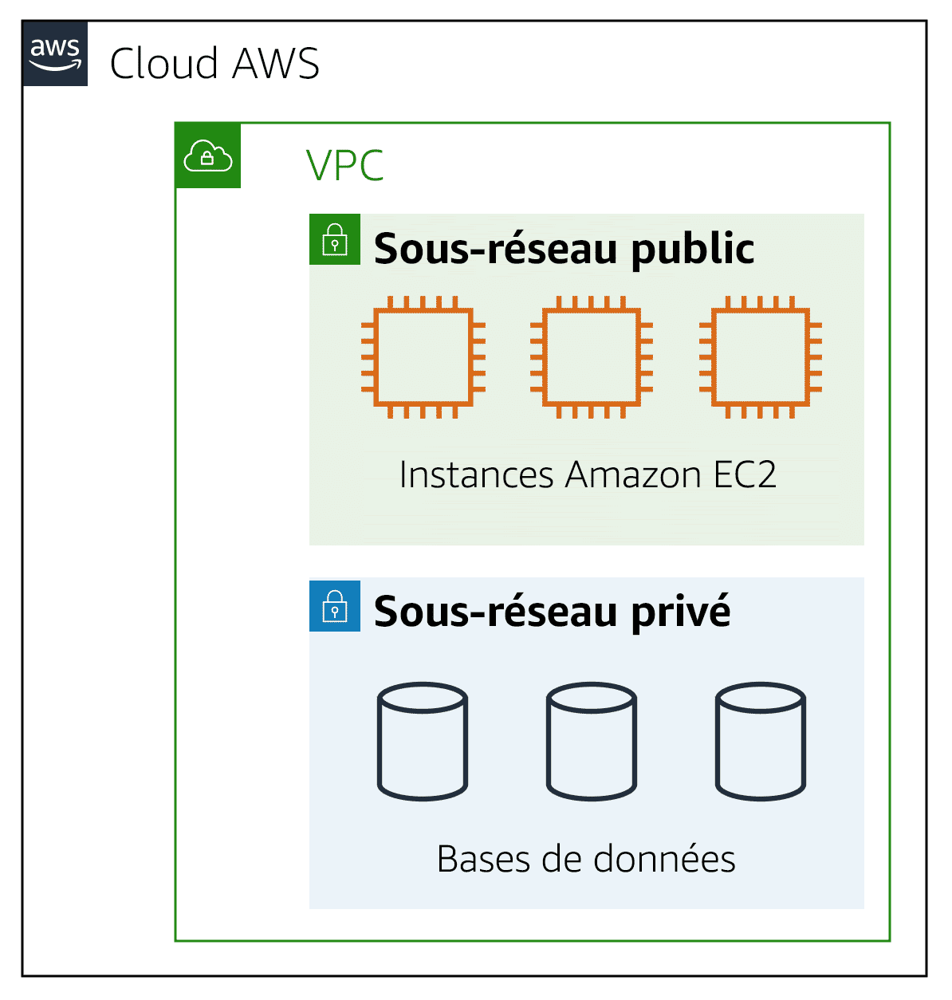
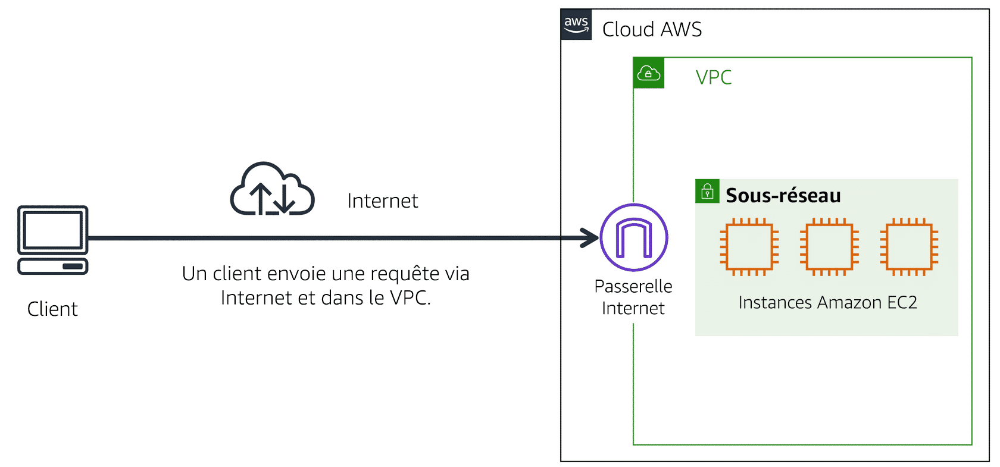
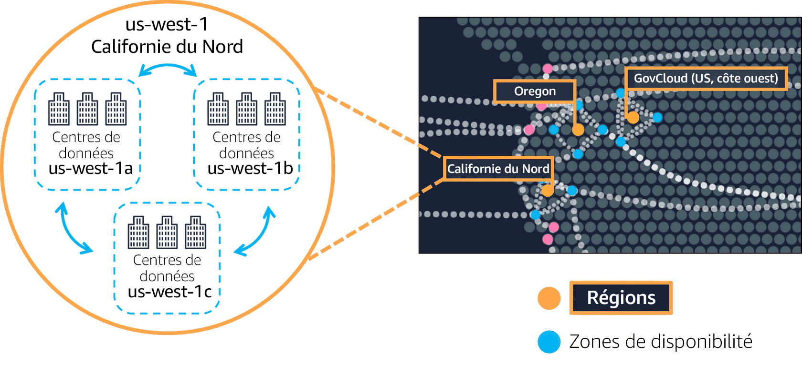

# SERVICES PRINCIPAUX

#### - Amazon Elastic Compute Cloud / EC2 (serveurs virtuels appelés instances EC2)

    Fournit une capacité de calcul sécurisée et redimensionnable dans le cloud en tant qu'instances Amazon EC2

    Type d'instance:
        - usage général
        - calcul optimisé
        - mémoire optimisée
        - calcul accélé
        - stockage optimisé

    Type de tarification:
        - à la demande
        - "Savings Plan Amazon EC2"
        - instances réservées
        - instance Stot
        - Hôtes dédiés

    Type de mise à l'échelle (Auto Scaling Amazon EC2):
        - dynamique
        - prédictive

#### - AWS Lambda (serverless)

    - Execution de code sur déclencheurs
    - 15 min max pour une exécution
    - Se déclenche à partir d'une source d'événement, 
      telle que des services AWS, des applications mobiles ou des points de terminaison HTTP.
    - Vous ne payez que le temps de calcul que vous utilisez.

#### - Amazon Simple Queue Service / SQS

    - Service de mise en file d'attente de messages
    - Stocker et recevoir des messages entre les composants logiciels
    - Un utilisateur ou un service extrait un message de la file d'attente, le traite, puis le supprime de la file d'attente

#### - Amazon Simple Notification Service / SNS

    - Service de publication/d'abonnement
    - Un éditeur publie des messages à l'intention des abonnés
    - Les abonnés peuvent être des serveurs web, des adresses e-mail, 
      des fonctions AWS Lambda ou plusieurs autres options

#### - Amazon Elastic Container Service / ECS

    - Prend en charge les conteneurs Docker
    - Utiliser les appels d'API pour lancer et arrêter des applications compatibles avec Docker

#### Amazon Elastic Service Kubernetes / EKS

    - Exécuter Kubernetes sur AWS
    - Gérer des applications conteneurisées à grande échelle

#### - AWS Fargate (serverless)

    - Permet d'exécuter vos conteneurs au-dessus d'une plateforme de calcul serverless
    - Sans serveur pour les conteneurs
    - Fonctionne avec Amazon ECS et Amazon EKS
    - Gère votre infrastructure de serveurs à votre place, vous ne devez pas allouer ou gérer des serveurs
    - Vous ne payez que les ressources nécessaires à l'exécution de vos conteneurs

# NETWORK

#### - Elastic Load Balancing

    - Distribue automatiquement le trafic d'application entrant sur plusieurs ressources, 
      telles que les instances Amazon EC2
    - Elastic Load Balancing et l'Auto Scaling Amazon EC2 travaillent ensemble des 
      performances et une disponibilité élevées

    

#### - Amazon CloudFront (CDN)

    - Permet de faire une copie (cache) d'une région dans une autre pour se rapprocher de certains clients
    - Emplacement périphérique ->  Site qu'Amazon CloudFront utilise pour stocker des copies mises en cache 
      de votre contenu plus près de vos clients, aux fins d'une diffusion plus rapide.

#### - Amazon Route 53 (DNS)

    - Connecte les requêtes des utilisateurs à l'infrastructure s'exécutant dans AWS
    - Peut acheminer les utilisateurs vers une infrastructure en dehors d'AWS
    - Gérer les enregistrements DNS pour les noms de domaine

#### - Amazon Virtual Private Cloud / VPC

    - Service de réseaux que vous pouvez utiliser pour établir des limites autour de vos ressources AWS
    - Permet définir les services public (accessible depuis internet) 
      et les services privé (accessible uniquement pour les autres services, ex: DB)

    

> ##### Passerelle Internet
>
> Une passerelle Internet est une connexion entre un VPC et Internet. Vous pouvez penser qu'une passerelle Internet
est semblable à une porte que les clients utilisent pour entrer dans le système.
Sans passerelle Internet, personne ne peut accéder aux ressources de votre VPC.

    

> ##### Zone de disponibilité
>
> Une zone de disponibilité est un centre de données unique ou un groupe de centres de données au sein d'une région.
Les zones de disponibilité sont situées à des dizaines de kilomètres les unes des autres. C'est assez proche pour
avoir une faible latence (le temps entre le moment où le contenu est demandé et le moment où il est reçu) entre les
zones de disponibilité. Toutefois, si un sinistre survient dans une partie de la région, elle est suffisamment éloignée
pour réduire les risques que plusieurs zones de disponibilité soient affectées.

    

# STORAGE

#### - Amazon Elastic Block Store / EBS -> fournit des volumes de stockage (par bloc), utilisable avec instance(s) EC2

    - Ressource de niveau 'zone de disponibilité' -> ex: centre de données us-west-1a
    - Volumes de donnée fix

#### - Amazon Elastic File System / EFS -> partage de fichier entre plusieurs clients (par bloc)

    - Permet plusieurs opérations simultanées en lecture / écriture
    - Système de fichiers linux
    - Ressource régionale -> ex: centre de données us-west-1a, us-west-1b, us-west-1c ...
    - Stockage illimité

#### - Amazon Simple Storage Service / S3 -> stockage d'objects (données, métadonnées, clé), qui est être stocké sur du long terme

    - Objets individuels d'une taille de 5 000 gigaoctets
    - Chaque objet a une URL dont vous pouvez contrôler les droits d'accès pour décider qui peut voir ou gérer l'image.
    - Ressource régionale -> ex: centre de données us-west-1a, us-west-1b, us-west-1c ...
    - Durables à 99, 999 999 %
    - Stockage illimité

> ##### Bloc vs Object
>
> Le stockage d'objets traite n'importe quel fichier comme un objet complet et discret.
C'est génial pour les documents et les fichiers image et vidéo qui sont téléchargés et consommés en tant qu'objets entiers,
mais chaque fois qu'il y a une modification de l'objet, vous devez télécharger à nouveau l'intégralité du fichier.
Il n'y a pas de mises à jour delta. Le stockage par bloc décompose ces fichiers en petites parties ou blocs de composants.
Cela signifie que, pour un fichier video de 80 gigaoctets, lorsque vous effectuez une modification à une scène du film et que vous l'enregistrez,
le moteur ne met à jour que les blocs où se trouvent ces bits. Si vous faites plusieurs micro-modifications, utiliser EBS,
Elastic Block Storage, est le cas d'utilisation parfait. Si vous utilisiez S3, chaque fois que vous enregistrez les modifications,
le système doit charger les 80 gigaoctets, la totalité, à chaque fois.

#### - Amazon Relational Database Service / RDS

**automatisation de :**

    - Provisionnement matériel
    - Configuration des bases de données
    - Application de correctifs et les sauvegardes

**Moteurs de bases de données :**

    - Amazon Aurora
    - PostgreSQL
    - MySQL
    - MariaDB
    - Oracle Database
    - Microsoft SQL Server

#### - Amazon Aurora

    - Base de données relationnelle d'entreprise
    - Compatible avec MySQL et PostgreSQL
    - Coûte 1/10e du coût des bases de données commerciales.
    - Cinq fois plus rapide que les bases de données MySQL et trois fois plus que les bases de données PostgreSQL
    - Réplique six copies de vos données sur trois zones de disponibilité et sauvegarde en permanence vos données
      sur Amazon S3

#### - Amazon DynamoDB

    - Serverless
    - Base de données NoSQL
    - Entièrement géré et hautement évolutif, mise à l'échelle automatique
    - Spécialement conçu, cas d'utilisation spécifiques   

#### - Amazon Redshift

    - Entreposage de données que vous pouvez utiliser pour l'analytique des Big Data
    - 10 fois plus de performances que les bases de données traditionnelles

#### - AWS Database Migration Service / AWS DMS

    - permet de migrer des bases de données relationnelles, des bases de données 
      non relationnelles ainsi que d'autres types de magasins de données.
    - Les bases de données sources et cibles peuvent être du même type ou de types différents.
    - La base de données reste opérationnelle pendant la migration
# AWS INTERACTION SERVICES

#### - AWS Management Console

    - Interface basée sur le web
    - Accéder à vos services AWS et les gérer
    - Surveillance des ressources, affichage des alarmes et accès aux informations de facturation
    - Plusieurs identités peuvent rester connectées à l'application mobile AWS Console en même temps

#### - AWS CLI

    - Interface de ligne de commande
    - Contrôler plusieurs services AWS directement à partir de la ligne de commande
    - Disponible pour les utilisateurs sous Windows, macOS et Linux 
    - Automatiser les actions effectuées par vos services et applications à l'aide de scripts

#### - Kits SDK (approche programmatique)

    - API conçue pour votre langage de programmation ou votre plateforme

#### - AWS Elastic Beanstalk

    Vous fournissez le code et les paramètres de configuration, et Elastic Beanstalk déploie les ressources 
    nécessaires pour effectuer les tâches suivantes :

        - Ajustement de la capacité
        - Load balancing
        - Mise à l'échelle automatique
        - Surveillance de la santé des application

#### - AWS CloudFormation

    - Infrastructure as code (json, yaml...)

# SECURITY

#### - AWS Identity and Access Management / IAM

    - Permet de gérer, de façon sécurisée, l'accès aux services et ressources AWS
    
    Différentes notions ->

        - **Utilisateur racine**: Identité à la création du compte, dispose d'un accès complet à tous les services 
          et ressources AWS du compte.
        - **Utilisateurs IAM**: identité que vous créez dans AWS, représente la personne ou l'application qui interagit 
          avec les services et ressources AWS. Il se compose d'un nom et d'informations d'identification.
        - **Stratégies IAM**: Document qui autorise ou refuse des autorisations aux services et ressources AWS
        - **Groupes IAM**: Ensemble d'utilisateurs IAM, avec possibilité d'attribution de stratégies IAM au niveau du groupe
        - **Rôles IAM**: Identité pour obtenir un accès temporaire aux autorisations

#### - AWS Organizations

    - Permet de contrôler de manière centralisée les autorisations pour les comptes de votre organisation à l'aide
      de politiques de contrôle des services (SCP -> imposer des restrictions sur les services AWS). 
    - Regrouper des comptes en unités d'organisation (UO) pour faciliter la gestion des comptes ayant des exigences 
      commerciales ou de sécurité similaires.
