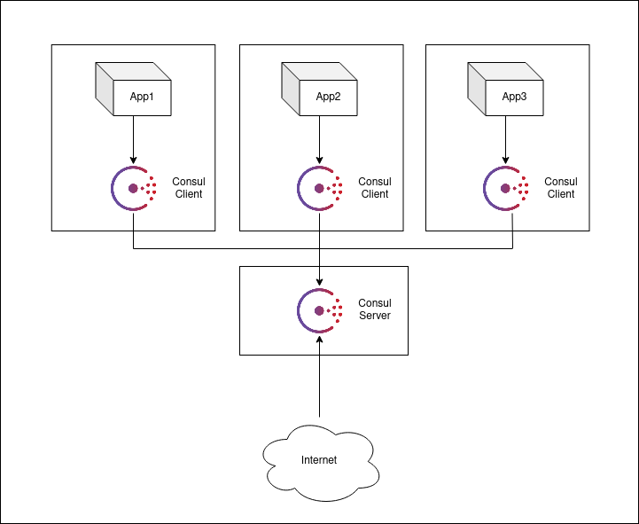

# Consul

## Reproduction du schéma

<p align="center">
    
</p>

### Les commandes

Mise en place de l'infrastructure avec la commande suivante :

```
./docker-debian.sh --create 4
```

#### Server

```
docker cp installConsul.sh $USER-debian-1:/tmp
```

```
docker cp execConsulServer.sh $USER-debian-1:/tmp
```

```
ssh root@172.17.0.2
```

```
cd /tmp/ && chmod 755 installConsul.sh && ./installConsul.sh && ./execConsulServer.sh
```

#### Clients

```
docker cp installConsul.sh $USER-debian-2:/tmp
```

```
docker cp execConsulClient.sh $USER-debian-2:/tmp
```

```
ssh root@172.17.0.3
```

```
cd /tmp/ && chmod 755 installConsul.sh && ./installConsul.sh 172.17.0.3 && ./execConsulClient.sh 172.17.0.3 172.17.0.2
```

### DNS tests

```
dig @172.17.0.2 -p 8600 ${service}.service.consul SRV +short
```

## Ajuster l'adresse de la CLI

Par défaut la cli Consul pointe sur localhost (127.0.0.1), pour modifier cette valeur, éxecuter la commande suivante

```
$ export CONSUL_HTTP_ADDR=http://172.16.0.2:8500
```

## Access Control List (ACL)

Ajouter la stanza suivante dans la configuration du serveur / client pour l'initialisation des acl

```
acl = {
  enabled = true
  default_policy = "deny"
  enable_token_persistence = true
}
```

La commande suivante initialise les ACL et fournis le secret ID. Il permet d'effectuer toutes les opérations.
Il doit être utilisé pour la création de nouveaux tokens et de policies

```
$ consul acl bootstrap
```

Pour effectuer des opérations avec la CLI il faut exporter la variable d'environnement CONSUL_HTTP_TOKEN

```
$ export CONSUL_HTTP_TOKEN="BOOTSTRAP_SECRET_ID"
```

La commande suivante applique des policies :

```
$ consul acl policy create \
  -name "nomad-client" \
  -description "Nomad Client Policy" \
  -rules ./policies/nomad-client-policy.hcl
```

Voiçi la commande pour créer un token et lui appliquer des policies,
dans le cas ou un nomad est client et server nous lui appliquons les 2 policies

```
$ consul acl token create \
  -description "Nomad Demo Agent Token" \
  -policy-name "nomad-server" \
  -policy-name "nomad-client" | tee nomad-agent.token
```

