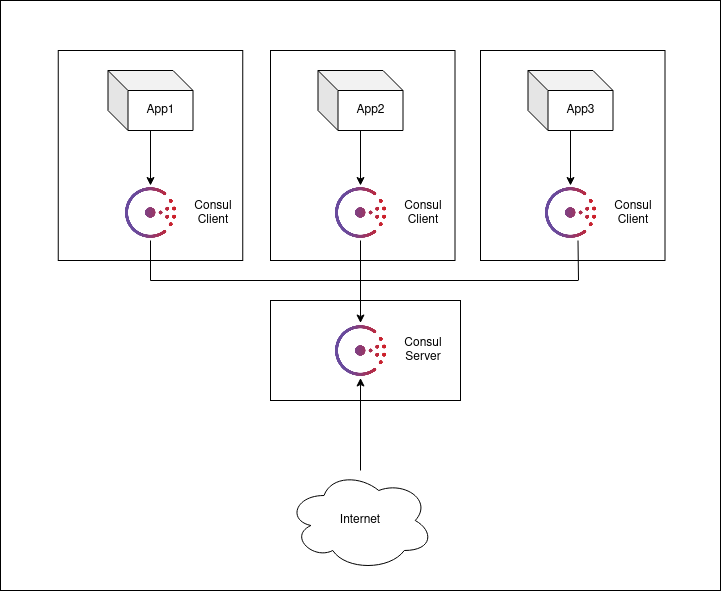

# Reproduction du schéma

<p align="center">
    
</p>

## Les commandes

```
./docker-debian.sh --create 4
```

### Server

```
docker cp installConsul.sh $USER-debian-1:/tmp
```

```
docker cp execConsulServer.sh $USER-debian-1:/tmp
```

```
ssh root@172.17.0.2
```

```
cd /tmp/ && chmod 755 installConsul.sh && ./installConsul.sh && ./execConsulServer.sh
```

### Clients

```
docker cp installConsul.sh $USER-debian-2:/tmp
```

```
docker cp execConsulClient.sh $USER-debian-2:/tmp
```

```
ssh root@172.17.0.3
```

```
cd /tmp/ && chmod 755 installConsul.sh && ./installConsul.sh 172.17.0.3 && ./execConsulClient.sh 172.17.0.3 172.17.0.2
```

### DNS tests

```
dig @172.17.0.2 -p 8600 ${service}.service.consul SRV +short
```
