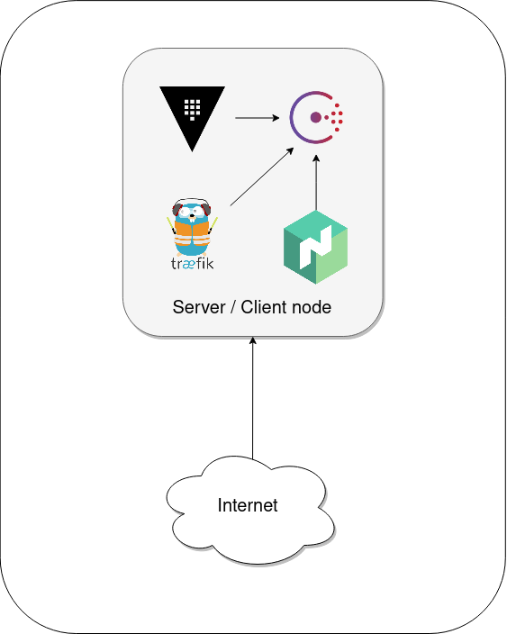
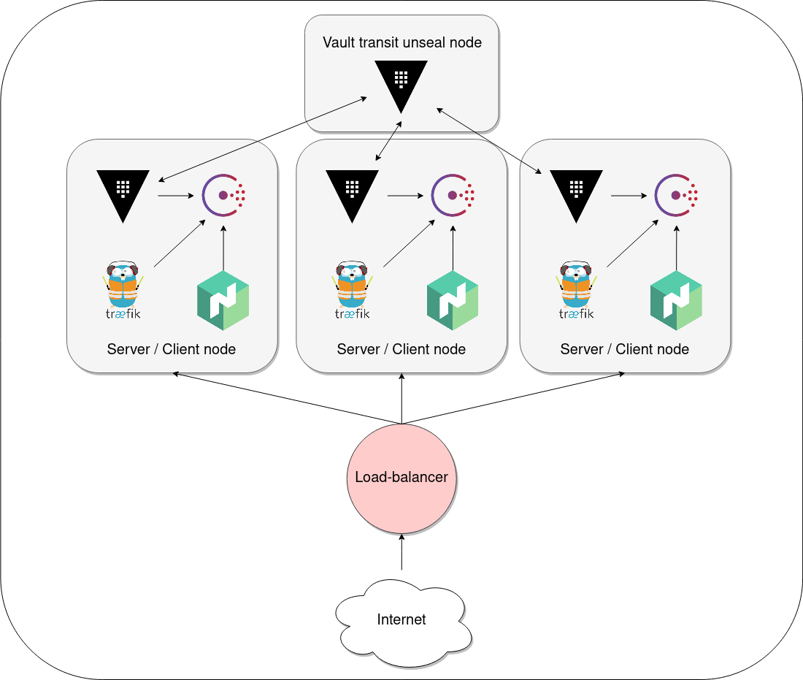

# Ansible

## Prérequis

Une dépendance à python3 est nécessaire pour le fonctionnement d'Ansible

```
$ sudo apt install python3
```

Une installation de [Vagrant](https://www.vagrantup.com/downloads) est également nécessaire.

## Installation

Les commandes pour l'installation d'ansible.

### Pip

```
$ sudo apt install python3-pip
```

```
$ pip3 install ansible==2.9.9
```

### Gestionnaire de paquet

```
$ sudo apt update
```

```
$ sudo apt install ansible
```

## Commandes

### Playbooks

La mise en place des VMs est nécessaire avant de lancer un playbook, faire un `vagrant up`
dans l'un des dossiers suivants :

- [1-node-vm](../hashiCorpStack/vagrant/standard-vm/1-node-vm) pour du single-node
- [4-nodes-vm](../hashiCorpStack/vagrant/standard-vm/4-nodes-vm) pour un cluster à 4 nodes

#### Single-node playbook

<p align="center">
    
</p>


Voiçi la commande pour lancer le playbook :

```
$ ansible-playbook -i inventory playbook-single-node.yml
```

#### 4 nodes cluster playbook

<p align="center">
    
</p>


Voiçi la commande pour lancer le playbook :

```
$ ansible-playbook -i inventory playbook.yml
```

**- URLs**

Consul:

- 172.16.0.2:8500
- (4-nodes-vm only) 172.16.0.3:8500
- (4-nodes-vm only) 172.16.0.4:8500

nomad:

- 172.16.0.2:4646
- (4-nodes-vm only) 172.16.0.3:4646
- (4-nodes-vm only) 172.16.0.4:4646

Vault:

- 172.16.0.2:8200
- (4-nodes-vm only) 172.16.0.3:8200
- (4-nodes-vm only) 172.16.0.4:8200

Traefik:

- 172.16.0.2:8081
- (4-nodes-vm only) 172.16.0.3:8081
- (4-nodes-vm only) 172.16.0.4:8081

WebApp:

- 172.16.0.2/myapp
- (4-nodes-vm only) 172.16.0.3/myapp
- (4-nodes-vm only) 172.16.0.4/myapp

**- Tokens**

Les dossiers vaultToken et vaultUnseal générés en local contiennent les clés de root, de unseal 
et de recovery des vaults.

Dans le scénario à 4 nodes les 3 vaults "actifs" sont unseal automatiquement par le vault qui dispose du transit

### Role

La commande pour la création de rôles, qui permettent de moduler la configuration

```
$ ansible-galaxy init tools
```

### Ansible-vault

Commande création de chiffrement pour les chaines de caractères

```
$ ansible-vault encrypt_string
```

L'option "ask-vault-pass" permet la demande de mot de passe, il existe aussi "vault-password-file"

```
$ ansible-playbook -i hosts playbook.yml --ask-vault-pass
```