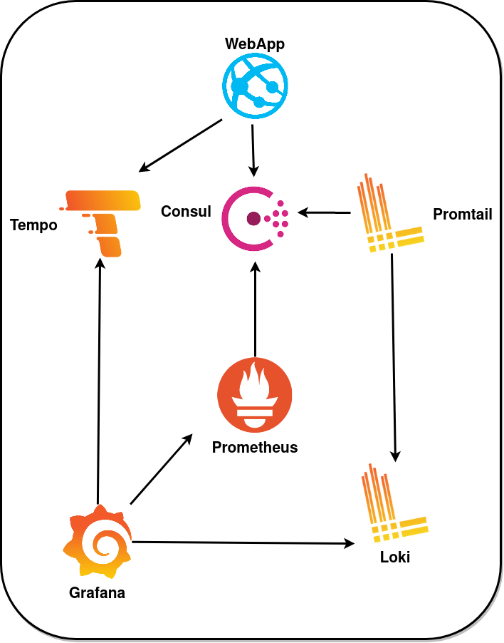
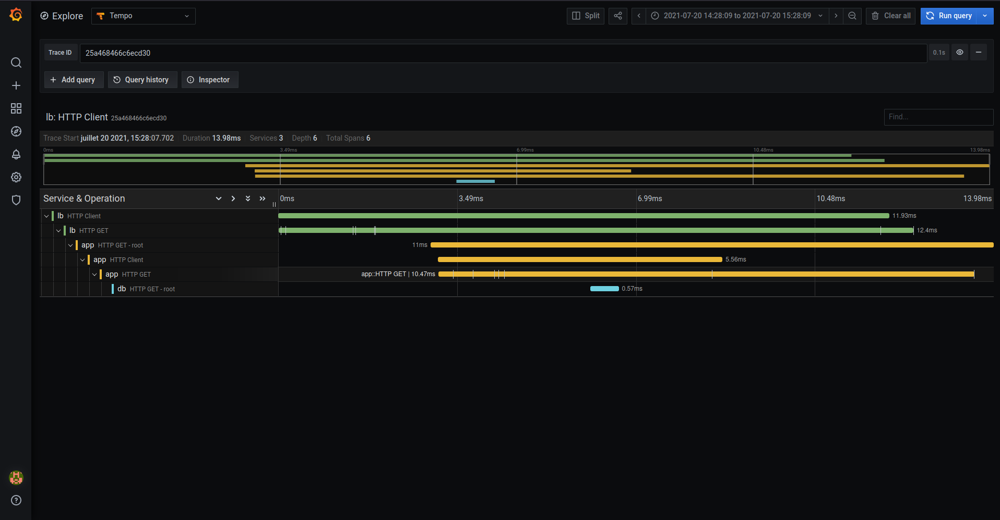

# GRAFANA STACK

    

## Grafana

Grafana vous permet d'**interroger**, de **visualiser**, d'**alerter** et de comprendre vos métriques, peu importe
où elles sont stockées.

Créez, explorez et partagez des tableaux de bord avec votre équipe et favorisez une culture axée sur les données.

[Le grafana labs](https://grafana.com/grafana/dashboards) propose des dashboards créés par la communauté

## Prometheus

Prometheus, un projet de la [Cloud Native Computing Foundation](https://www.cncf.io/), permet la surveillance
de système et de service.

Il collecte les **métriques** des cibles configurées à des intervalles donnés, évalue les expressions de règle,
affiche les résultats et peut déclencher des alertes lorsque des conditions spécifiées sont observées.

    

    

##  Loki

Un système d'agrégation de **logs** multi-tenant inspiré de Prometheus.

Une dispose petite taille d'index et des données de journaux hautement compressées, ce qui le rendent facile
et abordable à utiliser.

Open source, prend en charge divers backend de stockage cloud.

    

    

##  Promtail

Responsable de la collecte des logs et de leur envoi à Loki.

    

##  Tempo

Une solution open source de backend pour du **tracing** distribué, facile à utiliser et à grande échelle.

Tempo est très léger et est intégré à Grafana, Prometheus et Loki.

Prend en charge tous les protocoles de traçage open source, y compris Jaeger, Zipkin et OpenTelemetry.

    

    

