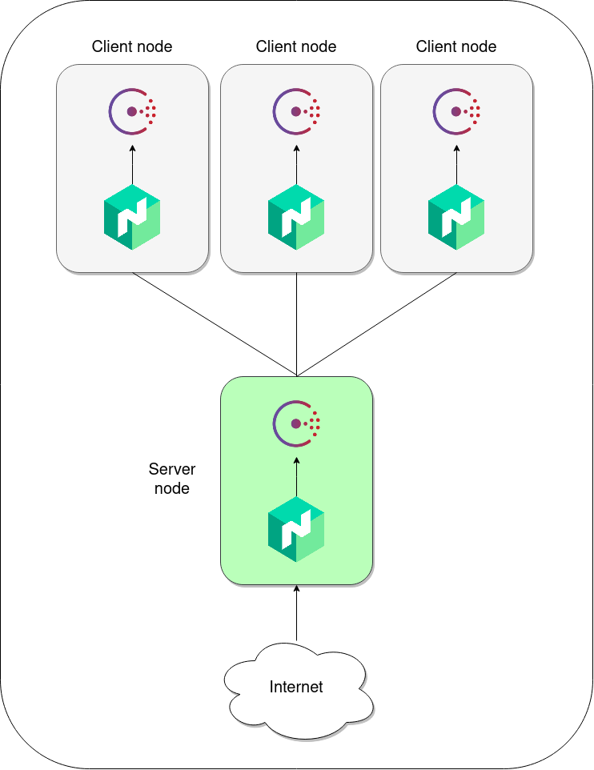
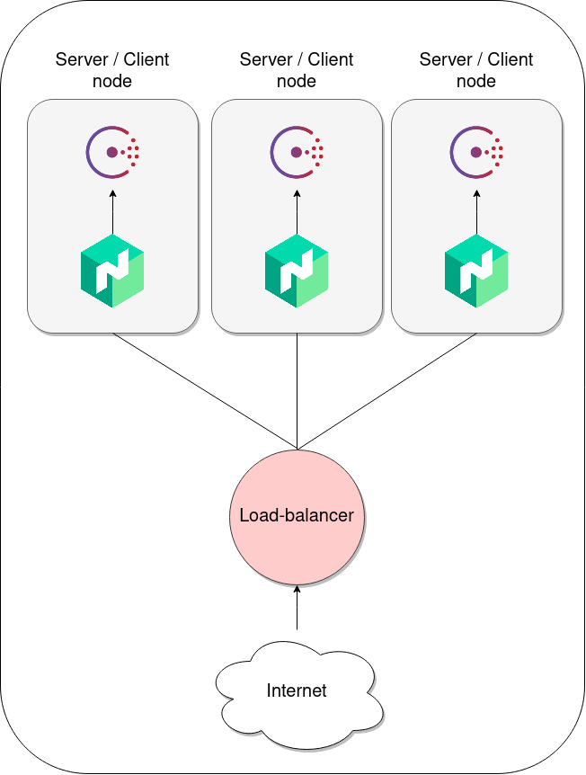

# Nomad

## Helpers

- Le fichier [jobHelper.nomad](./jobs/jobHelper.nomad) comporte des commentaires pour aider 
  à la compréhension de certaines stanza des jobs
- Le fichier [helper.policy.hcl](./policies/helper.policy.hcl) comporte des commentaires pour 
  aider à la compréhension de certaines stanza des policies
  
## Mise en place d'un cluster consul / nomad à 4 noeuds

<p align="center">
    
</p>

*Nécessite [Vagrant](https://www.vagrantup.com/downloads)
<br />
*Contexte [vagrant 4-nodes-vm](../vagrant/4-nodes-vm)

**Config**

- Nomad
  - [Install](./installNomad.sh)
  - [Client service](./execNomadClient.sh)
  - [Serveur service](./execNomadServer.sh)
- Consul
  - [Install](../consul/installConsul.sh)
  - [Client service](../consul/execConsulClient.sh)
  - [Serveur service](../consul/execConsulServer.sh)
- Vagrant
  - [Script initialisation](../vagrant/init.sh)
  - [Vagrantfile](../vagrant/4-nodes-vm/Vagrantfile)
  
**Commande**

```
$ Vagrant up
```

## Mise en place d'un cluster consul / nomad à 3 noeuds

<p align="center">
    
</p>


*Nécessite [Vagrant](https://www.vagrantup.com/downloads)
<br />
*Contexte [vagrant 3-nodes-vm](../vagrant/3-nodes-vm)

**Config**

- Nomad
  - [Install](./installNomad.sh)
  - [nomad service](./execNomadClientServer.sh)
  - [nomad conf](./config/nomadClientServerConfig.hcl)
- Consul
  - [Install](../consul/installConsul.sh)
  - [consul service](../consul/execConsulClientServer.sh)
  - [consul conf](../consul/config/consulClientServerConfig.hcl)
- Vagrant
  - [Script initialisation](../vagrant/init.sh)
  - [Vagrantfile](../vagrant/3-nodes-vm/Vagrantfile)

**Commande**

```
$ Vagrant up
```

## Mise en place d'un environnement de dev consul / nomad

*Nécessite [Vagrant](https://www.vagrantup.com/downloads)
<br />
*Contexte [vagrant dev-vm](../vagrant/dev-vm)

**Config**

- Nomad
  - [Install](./installNomad.sh)
  - [nomad service](./execNomadDev.sh)
  - [nomad conf](./config/nomadDevConfig.hcl)
- Consul
  - [Install](../consul/installConsul.sh)
  - [consul service](../consul/execConsulDev.sh)
  - [consul conf](../consul/config/consulDevConfig.hcl)
- Vagrant
  - [Script initialisation](../vagrant/init.sh)
  - [Vagrantfile](../vagrant/dev-vm/Vagrantfile)
  
**Commande**

```
$ Vagrant up
```

## Ajuster l'adresse de la CLI

Par défaut la cli Nomad pointe sur localhost (127.0.0.1), pour modifier cette valeur, éxecuter la commande suivante

```
$ export NOMAD_ADDR=http://172.16.0.2:4646
```

## Access Control List (ACL)

Ajouter la stanza suivante dans la configuration du serveur / client pour l'initialisation des acl

```
acl {
  enabled = true
}
```

La commande suivante initialise les ACL et fournis le secret ID. Il permet d'effectuer toutes les opérations.
Il doit être utilisé pour la création de nouveaux tokens et de policies

```
$ nomad acl bootstrap
```

Pour effectuer des opérations avec la CLI il faut exporter la variable d'environnement NOMAD_TOKEN

```
$ export NOMAD_TOKEN="BOOTSTRAP_SECRET_ID"
```

Le fichier [anonymous.policy](./policies/anonymous.policy.hcl) permet de configurer des policies de type anonyme, 
utilisé pour permettre l'accès temporaire à l'API nomad en attendant de mettre en place d'autre policies et 
des tokens. La commande suivante applique des policies de type anonyme :

```
$ nomad acl policy apply -description "Anonymous policy (full-access)" anonymous ./policies/anonymous.policy.hcl
```

Il existe 2 type de token : 
- management -> donne toutes les permissions
- client -> donne les permissions des policies attribuées

Voiçi la commande de création d'un token client

```
$ nomad acl token create -name="client1" -global -policy="app1"
```

## Générateur de charge (Hey)

L'outil [Hey](https://github.com/rakyll/hey) est un générateur de charge HTTP

La commande suivante va générer de la charge sur l'enpoint en question

```
$ hey -z 1m -c 30 http://172.16.0.2:8000
```

Option -z pour la durée de la charge et -c pour le nombre de requêtes en parallèle